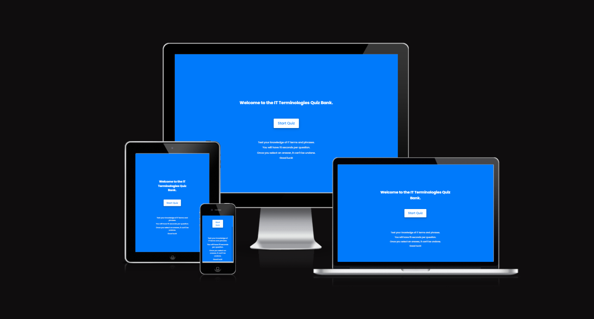
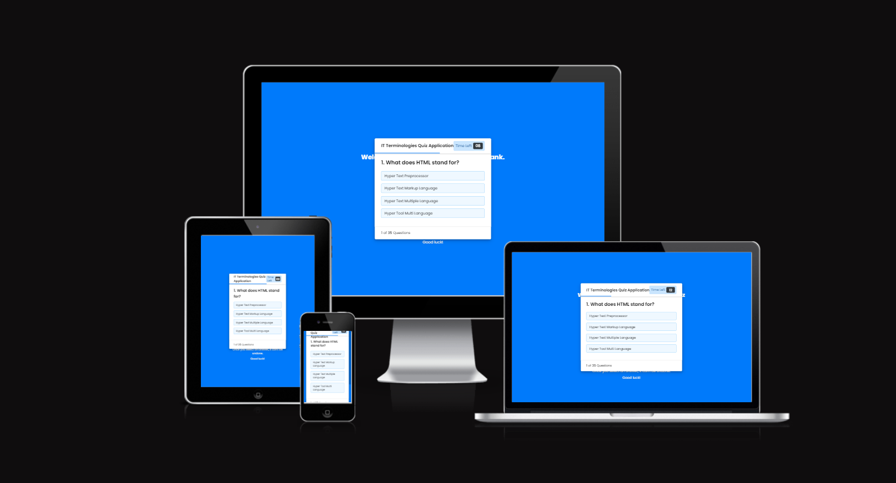
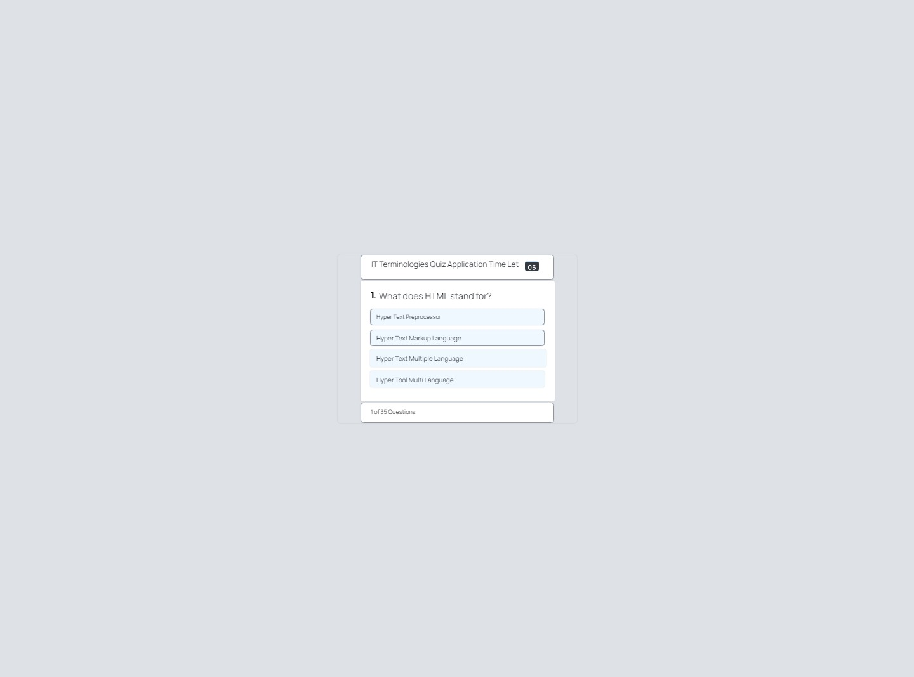
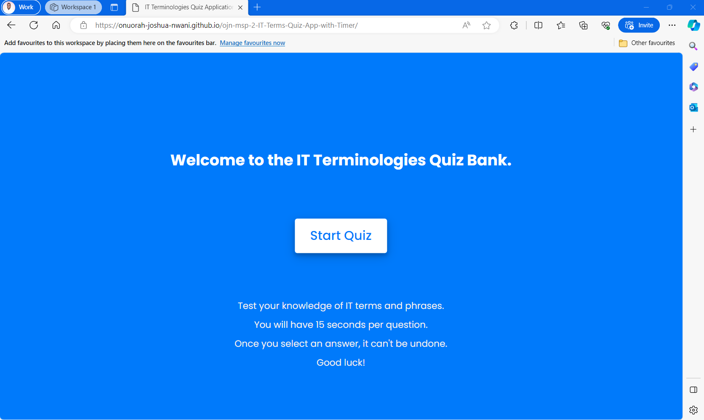
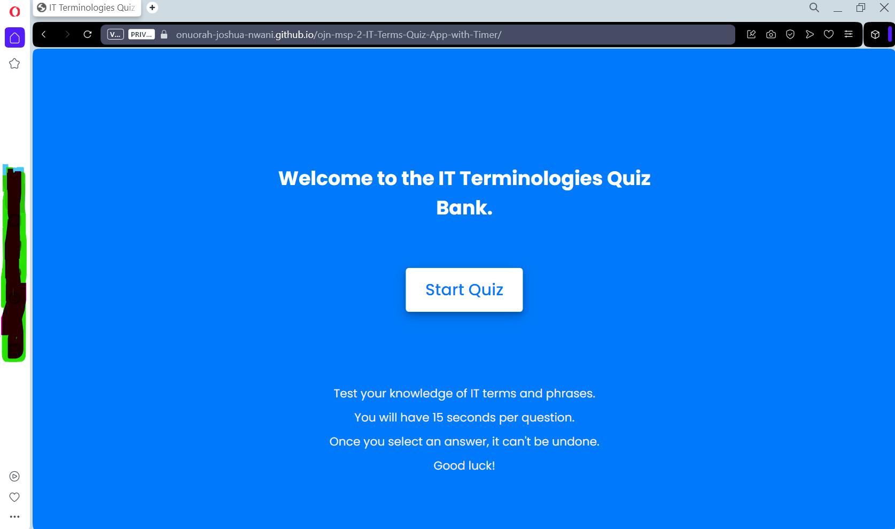

# Information Technology Terms Quiz Application

Welcome!

This project was carried out within the framework of my Second Milestone Project for the Full-Stack Web Development Diploma from the Code Institute.

Technologies used include HTML5, CSS3, and JavaScript to demonstrate my personal skills and acquired knowledge from this online program.

Code was written mostly on my own, but some libraries were also utilized to enhance functionality and CSS.

I would appreciate any feedback about your experience using this web application. Just fill out the contact form included in the application when you click on "Contact Us."

Website hosted on GitHub Pages here: [IT Terms Quiz Application](https://onuorah-joshua-nwani.github.io/ojn-msp-2-IT-Terms-Quiz-App-with-Timer/)

## UX

The primary goal of this project was to develop an interactive and user-friendly web application to test individuals' knowledge of various IT terminologies.

## Wireframe

The website was first designed using a wireframe which can be found on miro.com:

[Miro Wireframe - Second Milestone Project](https://app.visily.ai/projects/f3a5621b-2d9a-494c-b212-2149dda2c3d1/boards/584188)

## Features

### Current Features:

- **Introduction Box**: Provides a warm welcome and sets the quiz's expectation.
- **Info Box**: Lays out the quiz rules, ensuring users understand the guidelines.
- **Quiz Box**: The main area where questions and options are dynamically displayed with a timer.
- **Result Box**: Gives feedback on user performance after completing the quiz.

### Planned Features:

- **Multiple Quiz Categories**: Quizzes in specialized IT categories like Networking, Software Development, Cybersecurity, etc.
- **Leaderboard**: Displaying top scores to foster a competitive environment.
- **Review Mode**: Allowing users to review their answers post-completion.

## Technologies Used

- HTML5
- CSS3
- JavaScript
- [Font Awesome Icon Library](https://fontawesome.com/icons?d=gallery)
- [Am I Responsive](https://ui.dev/amiresponsive?url=https://onuorah-joshua-nwani.github.io/ojn-msp-2-IT-Terms-Quiz-App-with-Timer/)

## Testing

### Problem Solving:

- **Problem**: Difficulty in updating the UI in real-time as the user progresses through the quiz.
  - **Solution**: Leveraged JavaScript's DOM manipulation capabilities to dynamically render questions and options.
- **Problem**: Ensure that once an answer is selected, it cannot be changed.
  - **Solution**: Implemented event listeners that lock the user's choice and prevent further changes to that particular question.

### Unsolved Issues:

- **Problem**: Incorporating a responsive timer that visually counts down.
  - **Solution Pending**: Plan to integrate a dynamic countdown timer using CSS animations.

### Performance:

Full report here: [Light House Report](documentation/browser-testing/lighthouse.pdf)

### Front End:

Front-End Software and JavaScript performance were tested on real phones, laptops, and desktops using browsers like Chrome, IE, and Firefox.

### Back End:

Further back-end testing will be performed with automated tests once the back-end software is developed.

## Deployment

The code was developed on Codeanywhere and then pushed to a repository on [GitHub](https://github.com/Onuorah-Joshua-Nwani/ojn-msp-2-IT-Terms-Quiz-App-with-Timer.git). The application is hosted on GitHub Pages from the **master branch** and is currently live at: [IT Terminologies Quiz Bank](https://onuorah-joshua-nwani.github.io/ojn-msp-2-IT-Terms-Quiz-App-with-Timer/)

### Deployment Steps:

1. Log in to GitHub.com.
2. Select this project "/ojn-msp-2-IT-Terms-Quiz-App-with-Timer" from the repository screen.
3. Click on "Settings" at the top of the page.
4. Scroll to the GitHub Pages section.
5. Change the source to the "Master Branch" using the dropdown menu.
6. The application is now deployed on GitHub pages.
7. Copy and share the provided link.

## Credits

### Content:

- The quiz content and questions are designed for IT terminology testing.

### Media:

- FontAwesome icons enhance visual appeal.

### Acknowledgements:

- Inspiration came from my family.
- Thanks to my mentor from Code Institute: Elaine Roche (@elaineroche_mentor).
- Gratitude to the Tutor Team from Code Institute for their assistance.
